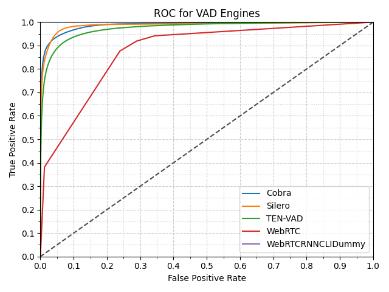

# Voice Activity Benchmark

[](https://github.com/Picovoice/voice-activity-benchmark/blob/master/LICENSE)

Made in Vancouver, Canada by [Picovoice](https://picovoice.ai)

The purpose of this benchmarking framework is to provide a scientific comparison between different voice activity
engines in terms of accuracy metrics. While working on [Cobra](https://github.com/Picovoice/Cobra)
we noted that there is a need for such a tool to empower customers to make data-driven decisions.


# Data

[LibriSpeech](http://www.openslr.org/12/) (test_clean portion) is used as the voice dataset.
It can be downloaded from [OpenSLR](http://www.openslr.org/resources/12/test-clean.tar.gz).

In order to simulate real-world situations, the data is mixed with noise (at 0dB SNR). For this purpose, we use
[DEMAND](https://asa.scitation.org/doi/abs/10.1121/1.4799597) dataset which has noise recording in 18 different
environments (e.g. kitchen, office, traffic, etc.). Recordings that contained distinct voice data is filtered out.
It can be downloaded from [Kaggle](https://www.kaggle.com/datasets/aanhari/demand-dataset).


# Voice Activity Engines

The following voice-activity engines are used:

- [py-webrtcvad](https://github.com/wiseman/py-webrtcvad) (Python bindings to the WEBRTC VAD)
which can be installed using [PyPI](https://pypi.org/project/webrtcvad/). Version 2.0.10.
Binary wheels are available for easy installation by using fork [py-webrtcvad-wheels](https://github.com/daanzu/py-webrtcvad-wheels) at [PyPI](https://pypi.org/project/webrtcvad-wheels/).
- [Cobra](https://github.com/Picovoice/Cobra) which is included as submodules in this repository,
or can be installed using [PyPI](https://pypi.org/project/pvcobra/). Version 1.2.0.
- [Silero VAD](https://github.com/snakers4/silero-vad) which can be installed using [PyPI](https://pypi.org/project/silero-vad/). Version 5.1.
- [TEN VAD](https://github.com/TEN-framework/ten-vad/pull/61).  This repo assumes MacOS on x86_64 (e.g.: Intel) running Python 3.12.  Otherwise run the `example_onnx` build for a Python extension module with your OS and CPU architecture and Python version.  Then move the generated *.so file to `lib/` folder.
- WebRTC RNN VAD, through a dummy implementation using a [CLI demo](https://github.com/daanzu/webrtc_rnnvad).


# Metric

We measured the accuracy of the voice activity engines using false positive and true positive rates.
The false positive rate is measured as the number of false positive frames detected over the total number of non-voice frames.
Likewise, true positive rate is measured as the number of true positive frames detected over the total number of voice-frames.
Using these definitions we plot a receiver operating characteristic curve which can be used to characterize performance differences between engines.


# Usage

### Prerequisites

The benchmark has been developed on Ubuntu 18.04 with Python 3.8. Clone the repository using

```bash
git clone https://github.com/Picovoice/voice-activity-benchmark.git
```

Make sure the Python packages in the [requirements.txt](/requirements.txt) are properly installed for your Python
version as Python bindings are used for running the engines.

Download and extract ONNX Runtime v1.22.0 for TEN VAD model with my setup (macOS
Intel x86_64).
```bash
cd
curl -OL https://github.com/microsoft/onnxruntime/releases/download/v1.22.0/onnxruntime-osx-x86_64-1.22.0.tgz
tar -xzf onnxruntime-osx-x86_64-1.22.0.tgz
rm onnxruntime-osx-x86_64-1.22.0.tgz
```

### Running the Benchmark

Usage information can be retrieved via

```bash
python3 benchmark.py -h
```

Benchmark commands.  Tested on macOS Intel x86_64 with Python 3.12.
```bash
tmux

cd
source ./venv_pv_vab/bin/activate

cd voice-activity-benchmark

# Set your dataset paths and PicoVoice access key.
LIBRISPEECH="--librispeech_dataset_path $HOME/Downloads/Librispeech/test-clean"
DEMAND="--demand_dataset_path $HOME/Downloads/demand"
ACCESS_KEY=<your token>

python3 benchmark.py $LIBRISPEECH $DEMAND --engine Cobra --access_key $ACCESS_KEY
python3 benchmark.py $LIBRISPEECH $DEMAND --engine Silero
python3 benchmark.py $LIBRISPEECH $DEMAND --engine TEN-VAD
python3 benchmark.py $LIBRISPEECH $DEMAND --engine WebRTC
```

The runtime benchmark is contained in the [runtime](/runtime) folder. Use the following commands to build and run the runtime benchmark:
```bash
git clone --recursive https://github.com/Picovoice/cobra.git runtime/cobra
cmake -S runtime -B runtime/build && cmake --build runtime/build
./runtime/build/cobra_runtime -l {COBRA_LIBRARY_PATH} -a {ACCESS_KEY} -w {TEST_WAVFILE_PATH}
```

# Results

## Accuracy

Below is the result of running the benchmark framework. The plot below shows the receiver operating characteristic curve
of different engines. This plot was generated with the Signal-To-Noise ratio of 0dB.




## Runtime

The table below shows the approximate realtime factor (RTF) of the engines while generating the accuracy ROC curve plot above on an Intel(R) Core(TM) i5-6500 CPU @ 3.20GHz. The RTF is calculated as the ratio of the total time taken to process the audio files to the total duration of the audio files.

| Engine          | RTF      |
|-----------------|----------|
| py-webrtcvad    | 0.000224 |
| WebRTC RNN VAD  | 0.003880 |
| Cobra           | 0.004222 |
| Silero VAD      | 0.007192 |

For Cobra only, the RTF can be computed using the runtime benchmark provided in the [Usage](#usage) section.
On a Raspberry Pi Zero, Cobra measured a realtime factor of `0.05`, or about `5%` CPU usage.
On a laptop with an Intel(R) Core(TM) i7-1185G7, Cobra measured a realtime factor of `0.0006`.
